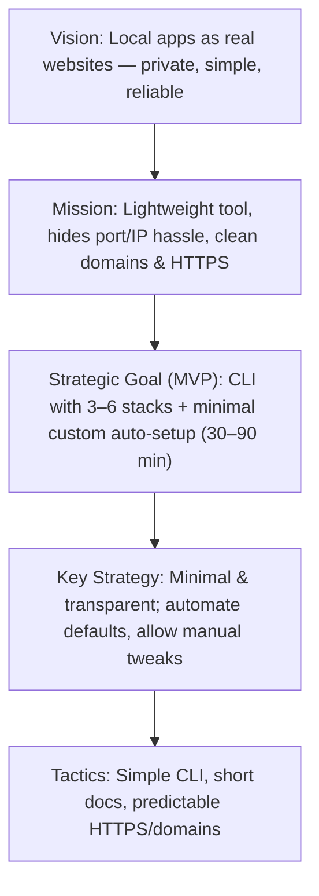

# Strategic Pyramid for locom

## Vision
Make local apps feel like real websites — private, simple, and reliable — without cloud complexity.  
*Inspired by Einstein’s principle: keep things “as simple as possible, but not simpler.”*  

## Mission
Provide a lightweight tool that hides port/IP hassle and gives Docker Compose apps clean domains and HTTPS locally, so even low-experience users can set up usable environments quickly.  

## Strategic Goal (MVP target)
Release a stable CLI that:  
- Ships with **3–6 pre-defined app stacks** ready to run out of the box.  
- Supports **minimal auto-setup** for a custom stack from a single Docker image.  
- (Optional extended metric): keep the time of initial single-stage setup scenario to **30–90 minutes** from installation to running a web app (depending on image download speed).  

## Key Strategy
Keep everything minimal and transparent: automate only the common-sense defaults, and always leave room for manual adjustment.  

## Tactic (Execution Focus)
- Develop CLI commands that “just work” for most setups.  
- Provide clear, short documentation for users who want to tweak manually.  
- Ensure domain/HTTPS setup is predictable and frictionless.  

---

## Mermaid Diagram

